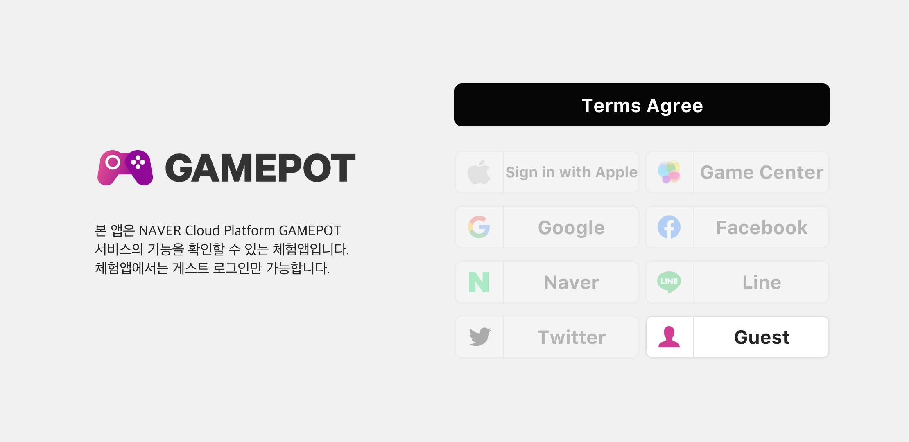

---
search:
  keyword:
    - gamepot
---

# Gamepot-Sample-Unity

## 사용하기 전에

해당 페이지는, NAVER CLOUD PLATFORM의 GAMEPOT에서 제공하는 GamePot 체험 앱(Unity)에 대한 가이드입니다.  

 [체험앱(APK) 다운로드](https://github.com/NaverCloudPlatform/gamepot-sample-unity/blob/master/GamePotTrial.apk) 

-------------------------------------------

**_`개발 환경 : Unity 2019.2.21f`_**

-  해당 앱은 GamePot SDK 기능 및 구현에 대한, `참고 용도의 체험 어플리케이션` 입니다. 실 서비스 개발은 `공식 SDK`를 통해 진행해주세요. 

- 체험앱에서는 `게스트 로그인`만 가능합니다. `소셜 로그인(연동)`을 체험하기 위해서는, repository 내 유니티 프로젝트에 소셜 로그인 키를 셋팅한 다음 빌드를 진행해주세요.

[ -> 공식 가이드 이동](https://docs.ncloud.com/ko/game/gamepot_unity.html)

-------------------------------------------

### Login

### Main

### Setting

